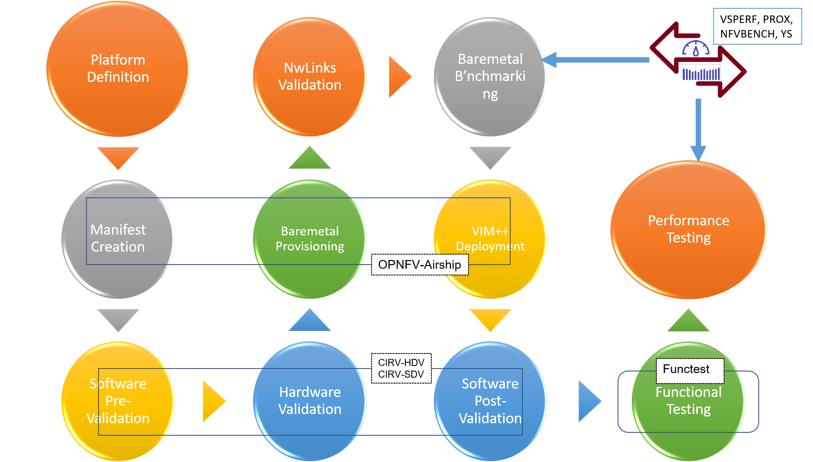
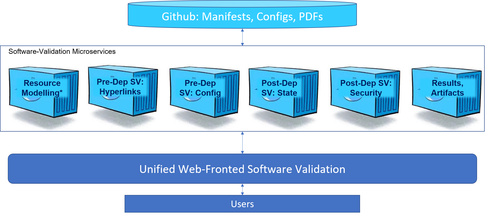
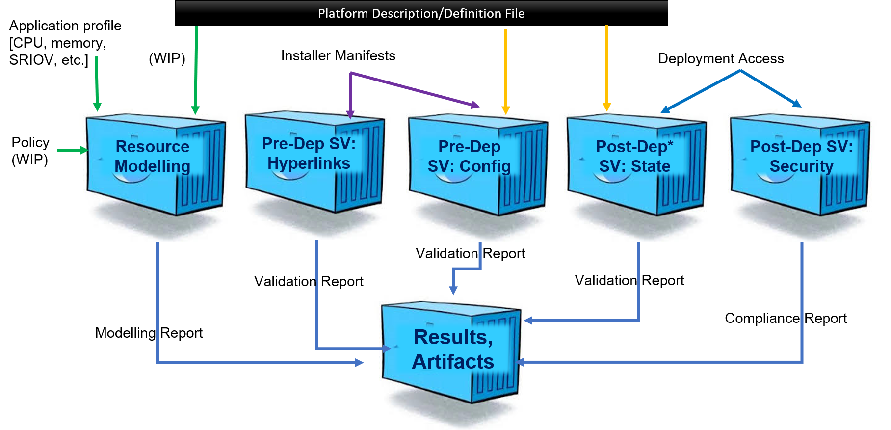

.. This work is licensed under a Creative Commons Attribution 4.0 International License.
.. http://creativecommons.org/licenses/by/4.0
.. (c) OPNFV, Spirent Communications and others

****************************************
OPNFV CIRV - Sofware Delivery Validation
****************************************

CIRV-SDV is an umbrella term used for collection of software validation tools. The term Software in SDV, refers to mainly two things:

* Installer Manifests
* Infrastructure Configuration

CIRV-SDV aims to perfom the validation of the software configuration, against the design and requirements, that are preferably defined in a unified machine-readable format. Hence, the whole project relies heavily on an implementation of PDF 2.0 defined in CNTT.

=======
PDF 2.0
=======

The platform description is defined in CNTT RI-1 Chapter-6. CIRV-SDV includes a JSON-based implementation of this platform description. In *sdv/pdf/template*, user will find the template file, which can be used to customize for their environment. Alternatively, user can use a GUI tool in *sdv/pdf/site* folder.

===============
The Big Picture
===============

The below figure summarizes the applicability of CIRV-SDV, and it role in overall cloud deployment.

=====================
CIRV-SDV Architecture
=====================

The below figure provides architecture (containerized version) of CIRV-SDV. CIRV-SDV will also include non-containerized version in future.

======================
CIRV-SDV Control Flow
======================

The below figure summarizes the control-flow among different components. From the below figure, user can see the importance of PDF.

