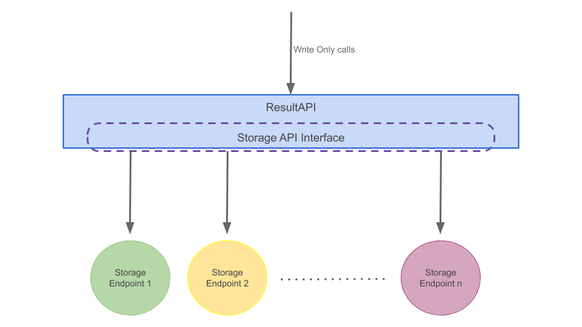

SDVState: Result API
====================

Table of contents
^^^^^^^^^^^^^^^^^

-  `Description <#Description>`__
-  `Architecture <#Architecture>`__
-  `Managing configuration <#Managing%20configuration>`__
-  `How to Use <#How%20to%20Use>`__

----------------------

Description
~~~~~~~~~~~

Result API is very simple write-only API for storing results of any size
to multiple storage endpoints.

Results API focuses on only sending test results to required
destinations so that they can be later viewed by user but do not
implements read functionality as this is not required while running
tests

Usage is very simple:
'''''''''''''''''''''

.. code:: python

    from result_api import result_api as api
    from result_api import Local

    # First register storage enpoints
    endpoint = Local()
    api.register_storage(endpoint)

    # Now, use anywhere in program
    api.store(data)

Note: In above example we used only one storage endpoints so, whenever
``api`` will make call to ``store()`` method it will be used. But if
register multiple storage endpoints then whenever ``api`` will make call
to ``store()`` method all endpoints will be called to store data. This
package doesn't allows to selectively make calls to different storage
endpoint for storing. Instead follows **one api -> many endpoint (one to
many)** design.

----------------------

Architecture
~~~~~~~~~~~~

|img|

*ResultsAPI exports data to various storage endpoints like harddisk,
SQL, Mongo, etc. exposed by StorageAPI in write-only mode*

----------------------

Managing configuration
~~~~~~~~~~~~~~~~~~~~~~

Result API uses `Conf: Program Settings handler <../conf/readme.md>`__
to manage all it's settings. So, user can change any settings of
ResultAPI as they need. ``Conf`` allows to change settings in two ways
either read from file ``settings.load_from_file(path/to/file)`` or set
inside program ``settings.setValue(key, Value)``

Configurations available:

+-----------------+---------------------+-------------------------------------+
| Storage         | setting             | optional                            |
+=================+=====================+=====================================+
| Local Storage   | results\_path       | Yes, defaults to ``/tmp/local/``    |
+-----------------+---------------------+-------------------------------------+
| Local Storage   | results\_filename   | Yes, defaults to ``results.json``   |
+-----------------+---------------------+-------------------------------------+

----------------------

How to Use
~~~~~~~~~~

For using ResultAPI successfully the following steps are required

#. **Import result\_api instance** from ResultAPI package as this
   instance will be commonly used across our program.
#. **Import required StorageAPI**
#. **Set Storage settings** or load settings from file
#. **Create Storage Endpoints from StorageAPI**
#. **Register Storage Endpoints with result\_api**

Now, result\_api is ready to use. We can send values to all registered
storage endpoints by making a simple call to ```store()``
method <#store()%20method>`__

store() method
''''''''''''''

``result_api`` has ``store(dict)`` method for storing data.

.. code:: python

    # data must be a dict
    data = { 'key1': "value1", 'key2': 5, 'dumykeytext': "dummy string value"}
    result_api.store(data)

rfile
'''''

rfile stands for result file. When you have extremely big value for a
key you would like to tell your storage endpoint to store them in
separate file and refer them in actual key. For storing value of type
file in result\_api use rfile construct.

.. code:: python

    data = { 'name': 'example', 'myfile': rfile('Text to store in this file')}
    result_api.store(data)
    # Respective StorageAPI will evaluate "data" for all rfile values and store their text in some separate file/storage-object and put there refernece in "data"

Use Local Storage with Result API
'''''''''''''''''''''''''''''''''

.. code:: python

    from result_api import result_api as api
    from result_api import Local
    from result_api import rfile

    def main():
        # Update settings required for Local storage
        settings.setValue('results_path', '/tmp/myresults/')
        settings.setValue('results_filename', 'results.json')
        
        # Register Local() to result_api, this will load above settings automatically
        api.register_storage(Local())
        
        data = { 'testcase': "RA1.24", 'value': 'Pass', 'logs': rfile('These are logs')}
        
        # Now, store any data
        api.store(data)

Register Storage Endpoint
'''''''''''''''''''''''''

.. code:: python

    from result_api.storage.mystorageapi import MyStorageAPI

    # Set required settings values for storage endpoint
    settings.setValue('mysetting1', 'value')
    settings.setValue('mysetting2', 'value2')

    #Now Register StorageAPI to ResultAPI
    endpoint = MyStorageAPI()
    api.register_storage(endpoint)

Changing settings
'''''''''''''''''

.. code:: python

    # Set values in a yaml file and load it
    settings.load_from_file('result.yml')

    # Or set in program
    settings.setValue('key', 'value')

    # Note above steps will only change settings values but will not impact any previously registered storage endpoints
    # To use endpoints with new value, register new endpoints
    endpoint = MyStorageAPI()
    api.register_storage(endpoint)

    # And do not forget to unregister old endpoint as they have old settings
    api.unregister_storage(old_endpoint)


