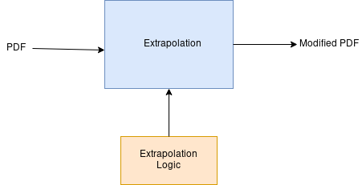
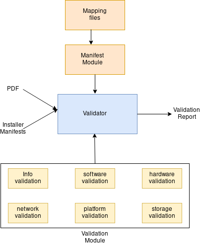
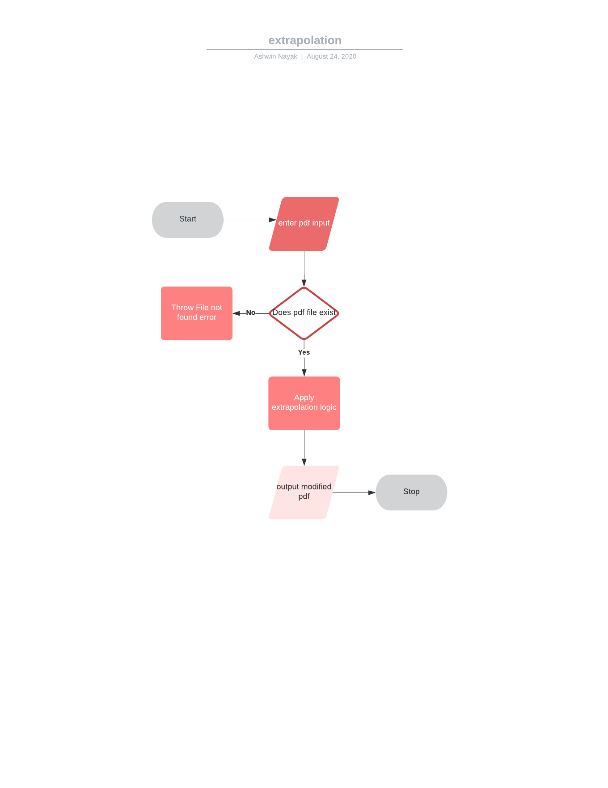
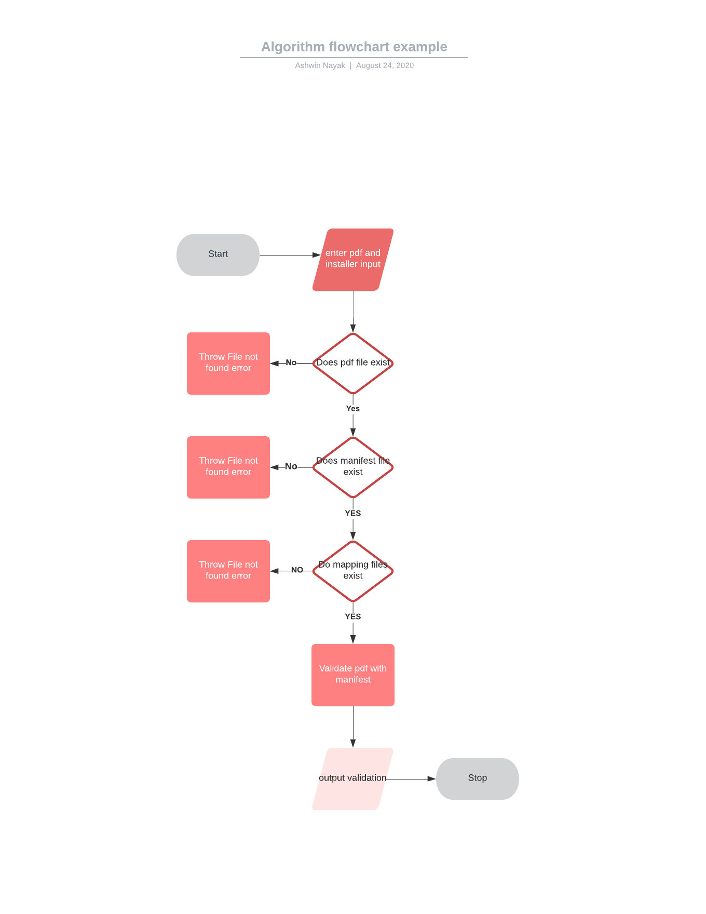

=========
SDVConfig
=========
Welcome to the SDVConfig Developer Guide!

Who should use this guide?

If you want to extend SDVConfig by using a creating a module, adding functionality to an existing module, or expanding test coverage, this guide is for you. We’ve included detailed information for developers on how to test and document modules, as well as the prerequisites for getting your module be accepted into the main SDV repository.

Table of Contents
^^^^^^^^^^^^^^^^^
- Description of the project
- Software architecture of the project
- Software technologies uses
- Setting up your local environment
- Flow of the project
- Project Structure
- Code walkthrough of core functionalities

Description of the project
^^^^^^^^^^^^^^^^^^^^^^^^^^
Cloud software validation is an upcoming project consisting of many microservices which all together form a single software validation solution. This documentation will be focused on one of the microservice namely SDV: Pre-Deployment Software Validation.

PDF(POD Descriptor File) is a standard, cloud-agnostic descriptor file meant to be used by Vendors/DC admins to describe the target Cloud Environment/Lab. One of the objectives of PDF is to provide interoperability between various Cloud-infrastructure and Vendors. My work at this internship aims to develop this PDF file further, add more details and develop some toolings around PDF to make it easier to consume by the end-user. The final process will involve validating PDF against installer manifests. The target installers being airship and TripleO.

In summary, the goals of the project are:
- Develop the PDF file further, add more details and develop some tooling around PDF to make it easier to consume by the end-user.
- Validate the existing PDF with installers.

Software architecture of the project
^^^^^^^^^^^^^^^^^^^^^^^^^^^^^^^^^^^^
There were two modules in SDVConfig, one is the extrapolation, which is a tooling around the PDF and validation, which validates the existing pdf with installers.

The software architecture of extrapolation module is as follows.


The software architecture of validation module is as follows.


Software technologies used
^^^^^^^^^^^^^^^^^^^^^^^^^^
The software technologies used in the project are
- Tornado module for creating rest-apis
- json module for handling json data
- yaml module for handling yaml data
- requests module for pushing data to testapi

Setting up your local environment
^^^^^^^^^^^^^^^^^^^^^^^^^^^^^^^^^
Use Python Virtual Environment Manager.

```
python3 -m pip install --user virtualenv
python3 -m venv env
source env/bin/activate
```

Install the required packages from requirements.txt.

```
pip install -r requirements.txt
```

Flow of the project
^^^^^^^^^^^^^^^^^^^
The flow of the two modules is shown in this detailed picture as shown below.

The flow diagram of the extrapolation module is as follows.



The flow diagram of the validation module is as follows.



Project Structure
^^^^^^^^^^^^^^^^^
The project structure is as follows.

.. code-block:: bash

    sdvconfig
    ├── cli_validation.py
    ├── Dockerfile
    ├── extrapolation
    │   ├── extrapolation.py
    │   └── __init__.py
    ├── manifest
    │   ├── __init__.py
    │   └── manifest.py
    ├── mapping
    │   ├── airship
    │   │   ├── hardware-mapping.json
    │   │   ├── info-mapping.json
    │   │   ├── network-mapping.json
    │   │   ├── platform-mapping.json
    │   │   ├── software-mapping.json
    │   │   └── storage-mapping.json
    │   ├── template
    │   │   ├── hardware-mapping.json
    │   │   ├── info-mapping.json
    │   │   ├── network-mapping.json
    │   │   ├── platform-mapping.json
    │   │   ├── software-mapping.json
    │   │   └── storage-mapping.json
    │   └── TripleO
    │       ├── hardware-mapping.json
    │       ├── info-mapping.json
    │       ├── network-mapping.json
    │       ├── platform-mapping.json
    │       ├── software-mapping.json
    │       └── storage-mapping.json
    ├── README.md
    ├── requirements.txt
    ├── server.py
    ├── testapi
    │   ├── __init__.py
    │   └── testapi.py
    └── validation
        ├── hardware.py
        ├── info.py
        ├── __init__.py
        ├── network.py
        ├── platform.py
        ├── software.py
        └── storage.py


Code walkthrough of core functionalities
^^^^^^^^^^^^^^^^^^^^^^^^^^^^^^^^^^^^^^^^
Extrapolation
"""""""""""""
The core code of extrapolation is as shown below.

.. code:: python
    def extrapolate(self):
        """ Perform Extrapolation """

        list_servers = []

        # get ipmi info
        count = 0

        for val in self.pdf["roles"]:
            num_servers = int(val["count"]) # Number of servers in the particular role.
            role = val["name"]

            for idx in range(num_servers):
                temp = dict()
                temp["role_name"] = role
                temp["device_name"] = str(role) + str(idx + 1)
                temp["az_name"] = "default"
                temp["ha_name"] = "default"

                temp["ilo_info"] = self.get_ilo_info(count)
                count += 1

                list_servers.append(temp)

We iterate through list of roles and generate list of servers with the following code. The IP values are picked from networks/ipmi/cidr from the pdf and is used in the extrapolation process.

Validation
""""""""""
The core code of validation is as shown below.

.. code:: python
    def validate(self):
        """ description about validation """
        # validate info
        correct, wrong, total, result = InfoValidation(
            self.json, self.manifest, self.logger).get_values()
        self.correct += correct
        self.wrong += wrong
        self.total += total
        string = (
            "The number of correct :{} wrong:{} and total:{} in info profile\n\n".format(
                self.correct,
                self.wrong,
                self.total))
        self.result += result + string

        # iterate through the roles: have a class for each for each of the roles
        for _, value in enumerate(self.json["roles"]):
            role = value["name"]
            # print(role,value["hardware_profile"])
            correct, wrong, total, result = HardwareValidation(
                self.json, value["hardware_profile"], self.manifest, self.logger).get_values()
            self.correct += correct
            self.wrong += wrong
            self.total += total
            string = (
                "The number of correct :{} wrong:{} and total:{} in hardware profile\n\n".format(
                    correct, wrong, total))
            self.result += result + string

            correct, wrong, total, result = StorageValidation(
                role, self.json, value["storage_mapping"], self.manifest, self.logger).get_values()
            self.correct += correct
            self.wrong += wrong
            self.total += total
            string = (
                "The number of correct :{} wrong:{} and total:{} in storage profile\n\n".format(
                    correct, wrong, total))
            self.result += result + string

            correct, wrong, total, result = SoftwareValidation(role, self.json, \
                value["sw_set_name"], self.manifest, self.global_sw_dir, self.type_sw_dir, \
                    self.site_sw_dir, self.logger).get_values()
            self.correct += correct
            self.wrong += wrong
            self.total += total
            string = (
                "The number of correct :{} wrong:{} and total:{} in software profile\n\n".format(
                    correct, wrong, total))
            self.result += result + string

            correct, wrong, total, result = PlatformValidation(
                role, self.json, value["platform_profile"], self.manifest, self.logger).get_values()
            self.correct += correct
            self.wrong += wrong
            self.total += total
            string = (
                "The number of correct :{} wrong:{} and total:{} in platform profile\n\n".format(
                    correct, wrong, total))
            self.result += result + string

            correct, wrong, total, result = NetworkValidation(role, self.json, \
                value["interface_mapping"], self.manifest, self.logger).get_values()
            self.correct += correct
            self.wrong += wrong
            self.total += total
            string = (
                "The number of correct :{} wrong:{} and total:{} in network profile\n\n".format(
                    correct, wrong, total))
            self.result += result + string

        self.testapi_result["timestamp"] = datetime.datetime.now()
        self.testapi_result["correct"] = self.correct
        self.testapi_result["wrong"] = self.wrong
        self.testapi_result["total"] = self.total

        # print the final report
        self.logger.info("Validation complete!")
        # push results to opnfv testapi
        PushResults(self.testapi_result, self.logger)

        return self.result

and one sample validation file, say hardware validation code is as follow.

.. code:: python
    def validate_profile(self, value):
        """ validate profile """
        val = ""
        profile = 'profile'
        keys = [
            'bios_version',
            'bios_mode',
            'bootstrap_proto',
            'hyperthreading_enabled',
            'bios_setting']

        for key in self.json[profile]:
            if key["profile_name"] == value:
                val = key
                break

        if val == "":
            self.logger.error("Not able to find bios profile name: %s", value)
        else:
            for key in keys:
                try:
                    temp1 = val[key]
                    temp2 = self.manifest.find_val(self.role, profile, key)
                    self.comparison(key, profile, temp1, temp2)
                except KeyError:
                    self.logger.error("Not able to find key: %s in profile: %s", key, value)

            self.logger.info("Completed with the validation of profile name:%s", value)

and the core recursive code which is used to find keys in the manifest files is as follows.

.. code::python
    def find_vals(self, key, temp_json):
        """ insert all matching json key-vals in array """
        # self.logger.info("temp_json value:%s", temp_json)
        for k, value in temp_json.items():
            if k == key:
                if isinstance(value, list):
                    for val in value:
                        self.vals.append(str(val))
                else:
                    self.vals.append(str(value))

            if isinstance(value, dict):
                found = self.find_vals(key, value)
                if found:
                    return True

            if isinstance(value, list):
                for _, val in enumerate(value):
                    if isinstance(val, str):
                        continue
                    found = self.find_vals(key, val)
                    if found:
                        return True
        return False

The code first iterates through all the profiles, and for each profile it checks with each key, gets its corresponding mapped value from the mapping files and checks whether the key exists in the installer manifest or not.